<p align="center">
  
</p>

<h1 align="center">TokenSavor Scrooge</h1>

<p align="center">
  <strong>한정된 AI 크레딧으로 더 많은 일을.</strong><br />
  Codex에 보내기 전 프롬프트와 텍스트 첨부 컨텍스트를 줄이고, 절감량을 감사 가능한 방식으로 기록하는 로컬 우선 데스크톱 앱입니다.
</p>

<p align="center">
  <a href="#빠른-사용법">빠른 사용법</a> ·
  <a href="#실측-자료">실측 자료</a> ·
  <a href="#신뢰성-원칙">신뢰성 원칙</a> ·
  <a href="#설치와-실행">설치와 실행</a>
</p>



## 무엇을 하나요?

Scrooge는 AI에 보내는 요청에서 낭비되는 토큰을 줄입니다. 단순히 문장을 짧게 만드는 도구가 아니라, 작업에 필요한 의미를 보존하면서 반복 로그, 긴 오류 출력, CSV/JSON/코드 첨부 컨텍스트를 AI가 처리하기 좋은 형태로 압축합니다.

주요 목표는 세 가지입니다.

- 사용자의 Codex 사용 흐름을 크게 바꾸지 않기
- 절감량을 `추정`, `통제 실측`, `provider 실측`으로 나누어 과장하지 않기
- 원문 전체를 저장하지 않고 감사 가능한 메타데이터 중심으로 기록하기

## 빠른 사용법

### Codex에서 바로 쓰기

1. Codex 입력창에 평소처럼 프롬프트를 작성합니다.
2. 파일을 첨부한 경우에도 그대로 둡니다.
3. 입력창에 커서를 둔 상태에서 `Ctrl + Alt + S`를 누릅니다.
4. Scrooge가 입력창 텍스트를 최적화하고, 가능한 경우 다시 붙여넣습니다.
5. 절감량은 Scrooge 앱의 사용 기록과 대시보드에 반영됩니다.

### 첨부 파일이 있을 때

Scrooge는 추가 조작을 줄이기 위해 같은 핫키에서 첨부 파일도 함께 처리합니다.

- Codex 화면에 보이는 첨부 파일명 칩을 감지합니다.
- 로컬에서 같은 파일을 유일하게 찾으면 텍스트 파일 본문을 읽어 압축합니다.
- `.log`, `.csv`, `.json`, `.md`, `.txt`, `.py`, `.ts`, `.tsx`, `.js`, `.java`, `.sql` 같은 텍스트 파일을 우선 지원합니다.
- 파일을 찾지 못하거나 PDF/이미지/Office처럼 본문 토큰을 안전하게 계산할 수 없으면 `첨부 미측정`으로 남깁니다.

이 방식은 Codex 내부 저장소나 메모리를 훑지 않습니다. 화면에 보이는 파일명과 로컬 파일 매칭만 사용합니다.

## 실측 자료

아래 수치는 저장소의 검증 리포트에서 가져온 통제 실측 결과입니다. 실제 청구 토큰은 provider usage metadata가 들어올 때 별도로 확정해야 합니다.

| 항목 | 결과 |
| --- | ---: |
| 품질 검증 세트 | 165 / 165 통과 |
| Backend tests | 48개 통과 |
| Hotkey 첨부 검증 | 통과 |
| Codex UI 첨부 감지 샘플 | `codex_uia` |
| `orders.csv` 첨부 절감 | 1,771 -> 148 tokens |
| `orders.csv` 첨부 절감률 | 91.64% |
| 전체 첨부 샘플 절감 | 7,491 -> 250 tokens |
| 전체 첨부 샘플 절감률 | 96.66% |
| 핫키 샘플 성공률 | 100% |

검증 리포트:

- [Hotkey attachment UIA validation](reports/hotkey-attachment-validation-uia-dev.json)
- [Installed attachment validation](reports/attachment-validation-installed.json)
- [A-ready validation snapshot](reports/a-ready-20260620-231540.json)

## 신뢰성 원칙

Scrooge는 절감액을 크게 보이게 만드는 것보다, 틀린 절감액을 보여주지 않는 것을 우선합니다.

| 상태 | 의미 |
| --- | --- |
| 추정 | 로컬 토크나이저 기반 사전 계산입니다. 실제 청구량과 차이가 날 수 있습니다. |
| 통제 실측 | Scrooge가 원본 텍스트와 압축 텍스트를 같은 로컬 기준으로 다시 계산한 값입니다. |
| provider 실측 | AI provider의 usage metadata로 확인된 값입니다. 가장 신뢰도가 높습니다. |
| 첨부 미측정 | 첨부 본문을 안전하게 읽지 못해 전체 절감률을 확정하지 않은 상태입니다. |

보안과 감사 기준:

- 원문 프롬프트 전문은 기본 저장하지 않습니다.
- 첨부 파일 전문도 저장하지 않습니다.
- 저장 대상은 해시, 토큰 수, 적용 규칙, 가격표 버전, 토크나이저 버전, 승인/거절 상태 중심입니다.
- 개인 감시보다 팀 단위 효율 개선을 기본 방향으로 둡니다.

## 주요 기능

- Prompt Optimizer: 장황한 요청을 구조화합니다.
- Context Compressor: 로그, stack trace, diff, CSV, JSON, 코드 파일을 핵심 중심으로 압축합니다.
- Token Meter: 원본/최적화 토큰과 예상 비용을 비교합니다.
- Efficiency Dashboard: 일간/주간/월간 절감 추세와 실측 커버리지를 보여줍니다.
- Hotkey Capture: `Ctrl + Alt + S`로 현재 입력창을 최적화합니다.
- Attachment-Aware Flow: Codex 화면의 첨부 파일명을 감지하고 가능한 경우 로컬 텍스트 파일을 압축합니다.
- Local Audit Storage: SQLite에 감사 가능한 최소 데이터만 저장합니다.

## 설치와 실행

### 일반 사용자

GitHub Release에 올라간 설치 파일을 실행합니다.

```text
Scrooge_0.1.0_x64-setup.exe
```

설치 후 Scrooge를 실행하면 백엔드는 sidecar로 함께 실행됩니다. 별도 터미널을 열 필요가 없습니다.

### 개발자

Backend:

```powershell
cd backend
python -m venv .venv
.\.venv\Scripts\Activate.ps1
pip install -e ".[dev]"
uvicorn scrooge.main:app --reload --port 8750
```

Frontend:

```powershell
cd frontend
npm install
npm run dev
```

설치 패키지 빌드:

```powershell
powershell -ExecutionPolicy Bypass -File scripts\build_reinstall_verify.ps1 -ApiBase http://127.0.0.1:8750
```

## 검증 명령

```powershell
.\backend\.venv\Scripts\python.exe -m pytest backend\tests
.\backend\.venv\Scripts\python.exe backend\tools\evaluate_optimization_quality.py
.\backend\.venv\Scripts\python.exe backend\tools\validate_hotkey_attachment_flow.py --api http://127.0.0.1:8750
```

## 현재 준비도

| 범위 | 판단 |
| --- | --- |
| 개인/개발 검증 | 가능 |
| 부서 내 제한 파일럿 | 가능 |
| 전사 배포 | 추가 파일럿 필요 |
| 실제 청구 절감 확정 | provider usage 연동 확대 필요 |

권장 파일럿:

- 대상: 5~10명
- 기간: 1~2주
- 지표: 핫키 성공률, 절감률, 첨부 미측정률, 사용자가 원문으로 되돌린 비율
- 운영 원칙: 실측값 없는 수치는 `예상 절감`으로만 표시

## 기술 스택

- Desktop: Tauri, React, TypeScript
- Backend: Python, FastAPI
- Storage: SQLite
- Packaging: PyInstaller sidecar, Tauri Windows bundle
- OS integration: Global hotkey, tray app, Windows UI Automation based attachment-name detection

## 한계

- Codex 내부 첨부 본문을 강제로 읽지 않습니다.
- 파일명이 중복되면 임의로 선택하지 않고 미측정 처리합니다.
- PDF, 이미지, Office 파일은 v1에서 토큰 절감 대상이 아니라 미측정 대상입니다.
- 실제 청구 절감액은 provider usage metadata가 있어야 확정할 수 있습니다.

## License

See [LICENSE](LICENSE).
