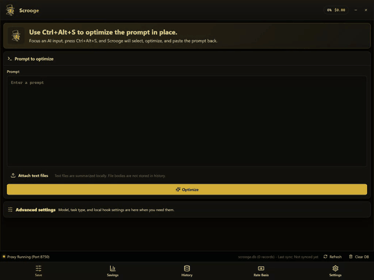

<p align="center">
  
</p>

<h1 align="center">TokenSavor Scrooge</h1>

<p align="center">
  <strong>Do more work with limited AI credits.</strong><br />
  A local-first desktop app that optimizes prompts, compresses text attachments, and records token savings in an auditable way before requests are sent to AI tools.
</p>

<p align="center">
  <a href="#why-scrooge">Why</a> |
  <a href="#how-it-works">How it works</a> |
  <a href="#measured-results">Measured results</a> |
  <a href="#install">Install</a> |
  <a href="#trust-model">Trust model</a>
</p>

> Status: alpha build for individual validation and limited department pilots. It is not yet positioned as a company-wide rollout product.

## Why Scrooge

AI coding tools are powerful, but enterprise teams often operate under monthly credit limits, user-level usage policies, and token-based cost tracking. The same task can consume very different token counts depending on how the prompt, logs, stack traces, diffs, and attached files are prepared.

Scrooge focuses on one practical goal:

> Reduce wasted input tokens without hiding uncertainty or changing the user's workflow too much.

It is not a generic prompt-shortening toy. It is designed around auditability, local storage, explicit measurement states, and conservative optimization rules.

## What It Does

- Optimizes long prompts before they are sent.
- Compresses repeated logs, stack traces, diffs, CSV, JSON, and source-code context.
- Estimates original and optimized token counts.
- Shows expected savings while clearly separating estimated values from measured values.
- Records minimal audit metadata in SQLite.
- Supports a global hotkey flow for Codex-style input boxes.
- Detects visible attachment file names in Codex Desktop and tries to match them to local files.

## How It Works

### Hotkey Flow

1. Write your prompt in Codex as usual.
2. Attach files as usual if needed.
3. Put the cursor in the input field.
4. Press `Ctrl + Alt + S`.
5. Scrooge captures the input text, optimizes it, and pastes the optimized version back when savings are available.
6. The result is reflected in the local dashboard and audit history.

Short, already clear prompts may show `0` saved tokens. That is intentional. Scrooge prioritizes preserving requirements over forcing a smaller prompt.

### Attachment-Aware Flow

When files are already attached in Codex Desktop, Scrooge tries to reduce user effort:

- It reads visible attachment names from the active window through Windows UI Automation.
- It searches safe local locations for a uniquely matching file name.
- If a supported text file is found, it compresses the file context and records controlled attachment savings.
- If the file cannot be found, is ambiguous, or is unsupported, it records the request as attachment-unmeasured instead of inventing savings.

Supported text-like file types include:

```text
.log, .csv, .json, .md, .txt, .py, .ts, .tsx, .js, .jsx, .java, .sql
```

Unsupported or unsafe-to-measure files, such as PDF, images, and Office documents, are treated as unmeasured in v1.

## Demo Video

<p align="center">
  <a href="docs/assets/scrooge-readme-demo.webm">
    
  </a>
</p>

<p align="center">
  <a href="docs/assets/scrooge-readme-demo.webm">Open the original WebM recording</a>
</p>

This is a real screen recording of the current production frontend build connected to a local FastAPI backend with a temporary SQLite database. It shows:

- prompt optimization,
- text attachment compression,
- savings dashboard update,
- audit history update.

No synthetic animation is used. The previous animated SVG mock did not match the actual app and has been removed.

To regenerate the video locally:

```bash
cd frontend
npm run record:readme-demo
```

The recording script uses a temporary database and generated demo CSV, so it does not modify your normal Scrooge usage history.

## Measured Results

These numbers come from repository validation reports. They are controlled measurements unless provider usage metadata is explicitly available. Controlled measurements are useful for product validation, but they are not the same as billing-confirmed provider usage.

| Metric | Result |
| --- | ---: |
| Golden quality suite | 165 / 165 passed |
| Backend test suite | 48 passed |
| Hotkey attachment validation | Passed |
| Codex UI attachment discovery sample | `codex_uia` |
| `orders.csv` attachment reduction | 1,771 -> 148 tokens |
| `orders.csv` attachment savings | 91.64% |
| Combined attachment sample reduction | 7,491 -> 250 tokens |
| Combined attachment sample savings | 96.66% |
| Hotkey sample success rate | 100% |

Validation reports:

- [Hotkey attachment UIA validation](reports/hotkey-attachment-validation-uia-dev.json)
- [Installed attachment validation](reports/attachment-validation-installed.json)
- [A-ready validation snapshot](reports/a-ready-20260620-231540.json)

## Trust Model

Scrooge separates savings into explicit states.

| State | Meaning |
| --- | --- |
| Estimated | Local tokenizer estimate. May differ from billed provider usage. |
| Controlled measured | Scrooge recalculates original and optimized content with the same local measurement method. |
| Provider measured | Confirmed by provider usage metadata. This is the highest-confidence state. |
| Attachment unmeasured | Attachment content was not safely readable, so total savings are not confirmed. |

Default privacy and audit behavior:

- Full prompt bodies are not stored by default.
- Full attachment contents are not stored by default.
- Audit records keep hashes, token counts, applied rules, tokenizer version, pricing version, and approval/rejection state.
- The dashboard is intended for team efficiency review, not individual surveillance.

## Install

Download the latest alpha release:

[Scrooge v0.1.0 alpha](https://github.com/nowuz47/TokenSavor/releases/tag/v0.1.0-alpha.1)

Available installers:

- `Scrooge_0.1.0_x64-setup.exe`
- `Scrooge_0.1.0_x64_en-US.msi`

After installation, Scrooge runs as a tray app and starts its FastAPI backend as a sidecar process. A separate terminal window is not required.

## Development

Backend:

```powershell
cd backend
python -m venv .venv
.\.venv\Scripts\Activate.ps1
pip install -e ".[dev]"
uvicorn scrooge.main:app --reload --port 8750
```

Frontend:

```powershell
cd frontend
npm install
npm run dev
```

Build and verify the Windows installer:

```powershell
powershell -ExecutionPolicy Bypass -File scripts\build_reinstall_verify.ps1 -ApiBase http://127.0.0.1:8750
```

## Verification

```powershell
.\backend\.venv\Scripts\python.exe -m pytest backend\tests
.\backend\.venv\Scripts\python.exe backend\tools\evaluate_optimization_quality.py
.\backend\.venv\Scripts\python.exe backend\tools\validate_hotkey_attachment_flow.py --api http://127.0.0.1:8750
```

## Readiness

| Scope | Current status |
| --- | --- |
| Individual development validation | Ready |
| Limited department pilot | Ready with caveats |
| Company-wide rollout | Needs more pilot data |
| Billing-confirmed savings | Needs broader provider usage integration |

Recommended pilot:

- 5 to 10 users
- 1 to 2 weeks
- Track hotkey success rate, savings rate, attachment-unmeasured rate, and user rollback rate
- Label non-provider-measured values as expected or controlled savings, not confirmed billing savings

## Tech Stack

- Desktop: Tauri, React, TypeScript
- Backend: Python, FastAPI
- Storage: SQLite
- Packaging: PyInstaller sidecar, Tauri Windows bundle
- OS integration: global hotkey, tray app, Windows UI Automation attachment-name detection

## Limitations

- Scrooge does not scrape Codex internal storage or process memory.
- If multiple local files share the same visible attachment name, Scrooge does not guess.
- PDF, image, and Office file token savings are not supported in v1.
- Billing-confirmed savings require provider usage metadata.
- Current release is Windows-focused.

## License

See [LICENSE](LICENSE).
